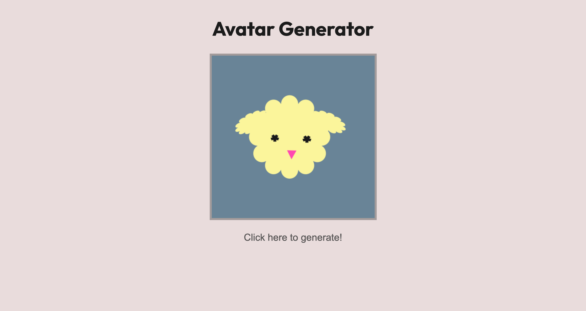

# Avatar Generator

This is a project to generate Avatar.

## Screenshot



### Links

- Live Site URL: [https://avatar-generator-ushisha.netlify.app/](https://avatar-generator-ushisha.netlify.app/)

## Built with

- Semantic HTML5 markup
- CSS
- Vanilla Javascript
- Affinity Designer

```JS
//create image element
const modelhead = new Image()
modelhead.src = `./images/head1.png`
//load head image
modelhead.onload = function(
{
buildmodel()
}
//construct image
function buildmodel()
{
const canvas = document.getElementById('canvas')
// create 2 dimentional canvas
const ctx = canvas.getContext('2d')
canvas.width= 400
canvas.height= 400
//draw head
 ctx.drawImage(medelhead,(400 - modelhead.width)/2,0)
}
```
